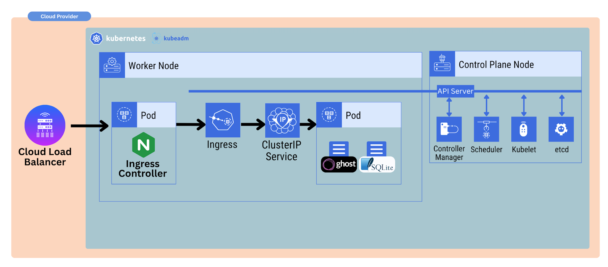

# Installing Ghost with Ingress & Cert-manager

[Access this lesson](https://community.kubeskills.com/c/kubernetes-from-scratch)

## What We Are Installing

- [Ghost](https://github.com/TryGhost/Ghost)
- [Nginx Ingress Controller](https://github.com/kubernetes/ingress-nginx)
- [Cert-manager](https://github.com/cert-manager/cert-manager)





---

### GitHub Repository

[https://github.com/chadmcrowell/k8s-from-scratch](https://github.com/chadmcrowell/k8s-from-scratch)


### Commands used in this Lesson

```bash
# linode CSI drivers
helm repo add linode-csi https://linode.github.io/linode-blockstorage-csi-driver/
helm repo update linode-csi

# deploy CSI driver
export LINODE_API_TOKEN=""
export REGION=""
helm install linode-csi-driver \
  --set apiToken="${LINODE_API_TOKEN}" \
  --set region="${REGION}" \
  linode-csi/linode-blockstorage-csi-driver

# install nginx ingress controller manifest in the 'ingress-nginx' namespace
kubectl apply -f https://raw.githubusercontent.com/kubernetes/ingress-nginx/controller-v1.13.3/deploy/static/provider/baremetal/deploy.yaml

# Install the cert-manager Helm chart
helm install \
  cert-manager oci://quay.io/jetstack/charts/cert-manager \
  --version v1.19.1 \
  --namespace cert-manager \
  --create-namespace \
  --set crds.enabled=true \
  --no-hooks


# create ghost namespace
kubectl create ns ghost

# create PVC
cat <<EOF | kubectl apply -f -
apiVersion: v1
kind: PersistentVolumeClaim
metadata:
  name: ghost-pvc
  namespace: ghost
spec:
  accessModes:
    - ReadWriteOnce
  storageClassName: linode-block-storage-retain
  resources:
    requests:
      storage: 8Gi
EOF

# list PVC
kubectl get pvc

# create ghost deployment and service
cat <<EOF | kubectl apply -f -
apiVersion: apps/v1
kind: Deployment
metadata:
  name: ghost
  namespace: ghost
spec:
  replicas: 1
  selector:
    matchLabels:
      app: ghost
  template:
    metadata:
      labels:
        app: ghost
    spec:
      containers:
      - name: ghost
        image: ghost:6-alpine
        ports:
        - containerPort: 2368
        env:
        - name: database__client
          value: sqlite3
        - name: database__connection__filename
          value: /var/lib/ghost/content/data/ghost.db
        - name: url
          value: https://mycluster.ddns.net
        volumeMounts:
        - name: ghost-content
          mountPath: /var/lib/ghost/content
      volumes:
      - name: ghost-content
        persistentVolumeClaim:
          claimName: ghost-pvc
---
apiVersion: v1
kind: Service
metadata:
  name: ghost
  namespace: ghost
spec:
  selector:
    app: ghost
  ports:
  - port: 2368
    targetPort: 2368
    name: http
EOF


# view secrets in the cert-manager namespace
kubectl -n cert-manager get secrets

# get ingressClass
kubectl -n ingress-nginx get ingressclass

# create clusterissuer
cat <<EOF | kubectl apply -f -
apiVersion: cert-manager.io/v1
kind: ClusterIssuer
metadata:
  name: ghost-tls
spec:
  acme:
    server: https://acme-v02.api.letsencrypt.org/directory
    email: chad@kubeskills.com
    privateKeySecretRef:
      name: ghost-tls
    solvers:
    - http01:
        ingress:
          ingressClassName: nginx
EOF

# get nodePort service for ingress controller
kubectl -n ingres-nginx get svc

# create ingress
cat <<EOF | kubectl apply -f -
apiVersion: networking.k8s.io/v1
kind: Ingress
metadata:
  name: ingress-ghost
  namespace: ghost
  annotations:
    nginx.ingress.kubernetes.io/backend-protocol: HTTP
    nginx.ingress.kubernetes.io/from-to-www-redirect: "true"
    nginx.ingress.kubernetes.io/proxy-body-size: 16m
    cert-manager.io/cluster-issuer: "ghost-tls"
spec:
  ingressClassName: nginx
  tls:
  - hosts:
    - mycluster.ddns.net
    secretName: ghost-tls
  rules:
  - host: mycluster.ddns.net
    http:
      paths:
      - path: /
        pathType: Prefix
        backend:
          service:
            name: ghost
            port:
              number: 2368
EOF

```


### Additional Resources
- [Bare-metal considerations - Ingress NGINX](https://kubernetes.github.io/ingress-nginx/deploy/baremetal/)
- [NoIP - Free DNS Names](https://noip.com)
- [MetalLB - LB for Bare Metal Clusters](https://metallb.io/)
- [MetalLB scenario similar to ours](https://medium.com/@DhaneshMalviya/ingress-with-metallb-loadbalancer-on-local-4-node-kubernetes-cluster-a0445357048)
- [What is Cloud Controller Manager - K8s Docs](https://kubernetes.io/docs/concepts/architecture/cloud-controller/)
- [AWS Cloud Controller Manager](https://github.com/kubernetes/cloud-provider-aws)
- [Google Cloud Controller Manager](https://github.com/kubernetes/cloud-provider-gcp)
- [Azure Cloud Controller Manager](https://github.com/kubernetes-sigs/cloud-provider-azure)
- [Linode Cloud Controller Manager](https://github.com/linode/linode-cloud-controller-manager)
- [Digital Ocean Cloud Controller Manager](https://github.com/digitalocean/digitalocean-cloud-controller-manager)
- [Alibaba Cloud Controller Manager](https://github.com/kubernetes/cloud-provider-alibaba-cloud)


- [AWS CSI Drivers](https://github.com/kubernetes-sigs/aws-ebs-csi-driver)
- [Azure CSI Drivers](https://github.com/kubernetes-sigs/azuredisk-csi-driver)
- [Google Cloud CSI Drivers](https://github.com/kubernetes-sigs/gcp-compute-persistent-disk-csi-driver)
- [Linode CSI Drivers](https://github.com/linode/linode-blockstorage-csi-driver)
- [Digital Ocean CSI Drivers](https://github.com/digitalocean/csi-digitalocean)
- [Alibaba CSI Drivers](https://github.com/kubernetes-sigs/alibaba-cloud-csi-driver)


---

[Next Lesson]

[Section 00 - Introduction and Installation](README.md)