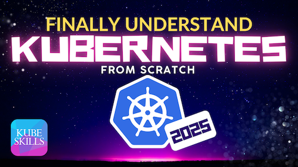

# Finally Understand Kubernetes from Scratch (2025) | Hands-On in Any Cloud

## SECTION 01: GitOps and Observability

- LESSON 05: Observability in Kubernetes with Prometheus & Loki
- LESSON 06: Deploying Applications with GitOps and ArgoCD
- LESSON 07: Apps Emitting Metrics, Logs, and Traces with OpenTelemetry
- LESSON 08: Visualizing Observability Data with Grafana

---

[GO BACK](../README.md)