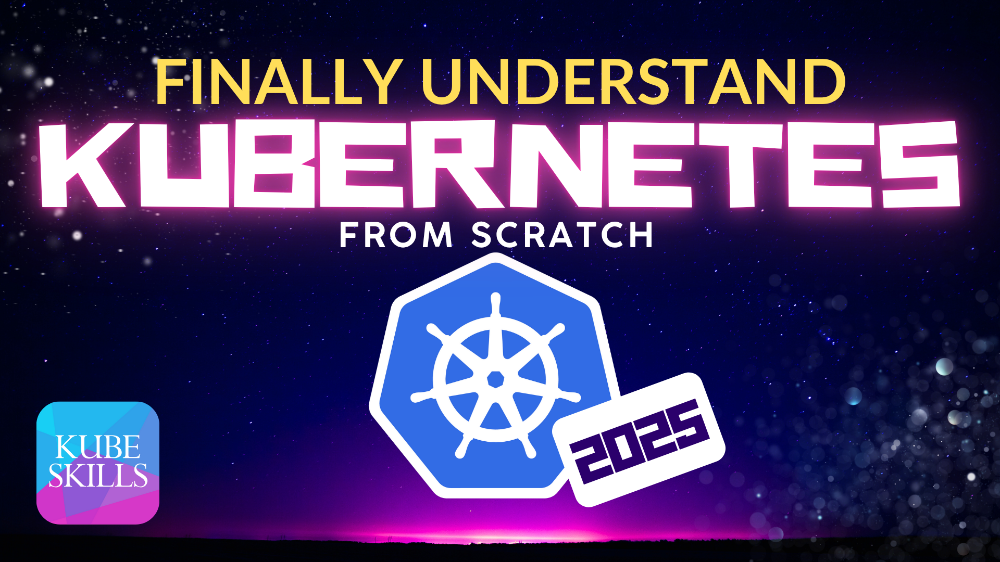

# Finally Understand Kubernetes from Scratch (2025) | Hands-On in Any Cloud

## SECTION 02: Extending Kubernetes with Operators and Custom Resources

- LESSON 08: What Are Custom Resource Definitions (CRDs)?
- LESSON 09: The Operator Pattern: Controllers That Watch and Act
- LESSON 10: Creating Your First Custom Resource Definition
- LESSON 11: Building a Simple Operator with Kubebuilder

---

[GO BACK](../README.md)